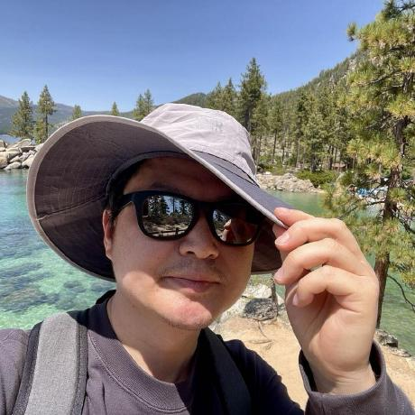

A personal site can start with a small ambition: make it easy to publish something worth keeping.

This example shows how a project post can combine words and media. The image lives beside this Markdown file, so the post and its assets travel together.

## An image beside the words



The Markdown for the image is simply:

```markdown

```

For a visible caption, use Hugo's figure shortcode:



## A little motion

Video is optional, user-controlled, and never starts automatically. This short, silent flower clip is a public-domain sample hosted by MDN.



Use a file in the post folder for a small clip, or an external URL for a larger one:

```text

```

YouTube embeds are available too:

```text

```

## What belongs in a project journal?

A useful starting point is the problem, the smallest working idea, and what changed after trying it. A photograph or short demonstration often explains more than a long feature list.

For the full writing and publishing instructions, see the README in this site's GitHub repository.
